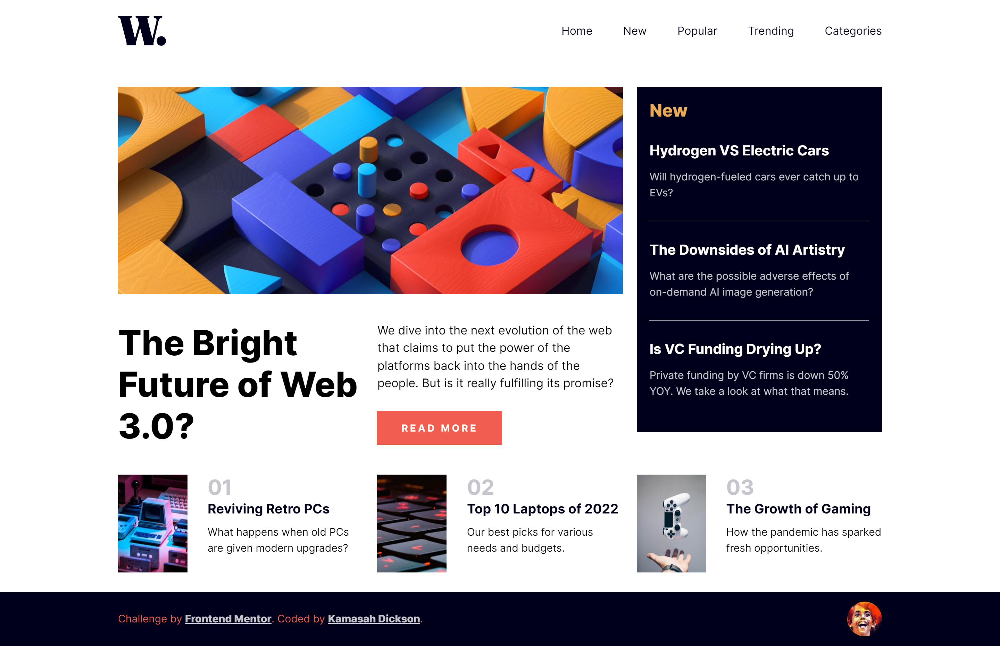
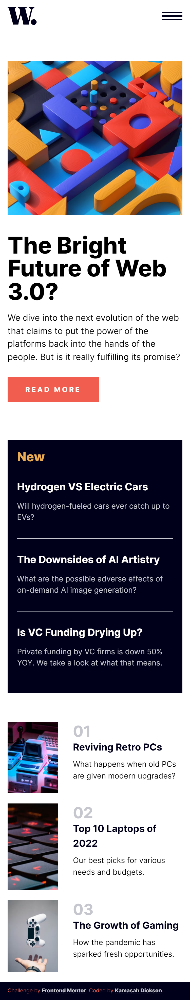

# Frontend Mentor - News homepage solution

This is a solution to the [News homepage challenge on Frontend Mentor](https://www.frontendmentor.io/challenges/news-homepage-H6SWTa1MFl). Frontend Mentor challenges help you improve your coding skills by building realistic projects.

## Table of contents

- [Overview](#overview)
  - [The challenge](#the-challenge)
  - [Screenshot](#screenshot)
  - [Links](#links)
- [My process](#my-process)
  - [Built with](#built-with)
- [Author](#author)

## Overview

### The challenge

Users should be able to:

- View the optimal layout for the interface depending on their device's screen size
- See hover and focus states for all interactive elements on the page
- **Bonus**: Toggle the mobile menu (requires some JavaScript)

### Screenshot

### Links

- Solution URL: [Solution](https://github.com/Kamasah-Dickson/Web-3.0-News-homepage)
- Live Site URL: [Live Solution](https://kamasah-dickson.github.io/Web-3.0-News-homepage/)

## My process

1. I designed the site on mobile first and scaled it to desktop.

2. Used sass mixins, sass partials to split the site into smaller components which helps in reducing the rate of causing errors and also sass functions to convert pixels into em and rem units;

3. Flexbox and Grid was used to layout this site from mobile layout to desktop;

### Built with

- Semantic HTML5 markup
- Flexbox
- CSS Grid
- Mobile-first workflow

## Author

- Frontend Mentor - [@Kamasah Dickson](https://www.frontendmentor.io/profile/Kamasah-Dickson)
- Twitter - [@Kamasah Dickson](https://twitter.com/Kamas_DEV)
